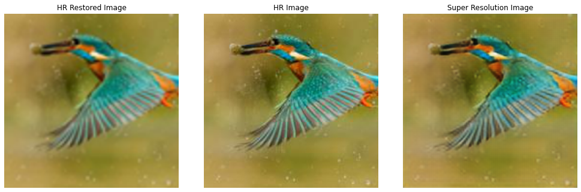
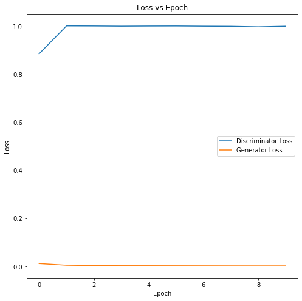
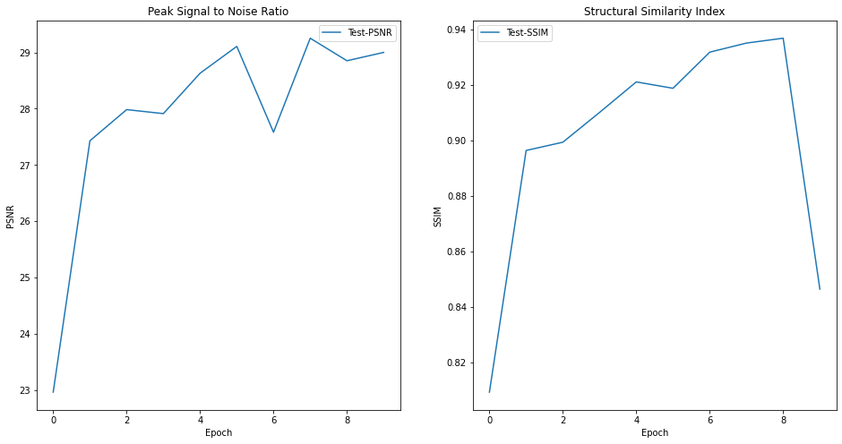

# Image Super Resolution

The objective here is to train SR-GAN (Super Resolution- Generative Adversial Network) on the flying objects dataset to provide Super resolution of the flying object images. The model is then deployed on AWS.

## Model hyperparameters

* Optimizer : Adam
* Loss function : Content Loss + Adversial Loss
* Batch size : 64
* Epochs : 10

## Model Architecture

GAN based model includes deep residual network for Generator network which is able to recover photo-realistic textures from heavily downsampled images. 

Model uses perceptual loss function which consists of an adversarial loss and a content loss. The adversarial loss pushes the solution to the natural image manifold using a discriminator network that is trained to differentiate between the super-resolved images and original photo-realistic images. In addition, the content loss compares deep features extracted from Super-resolved and High Resolution images with a pre-trained VGG network.

## Results

### Model results
Below are the results from SR-GAN. It consists of HR restored image (restored by Bicubic interpolation of the Low resolution image), actual input HR image (centercropped) and the Super Resolution result from the SR-GAN model.

### Generator/Discriminator Loss Trend versus Epoch

Shared below is the Generator/Discriminator Loss trend during training.

### PSNR and SSIM trend

Shared below are the Peak Signal to Noise Ratio and Structural Similarity Index trend during training.

